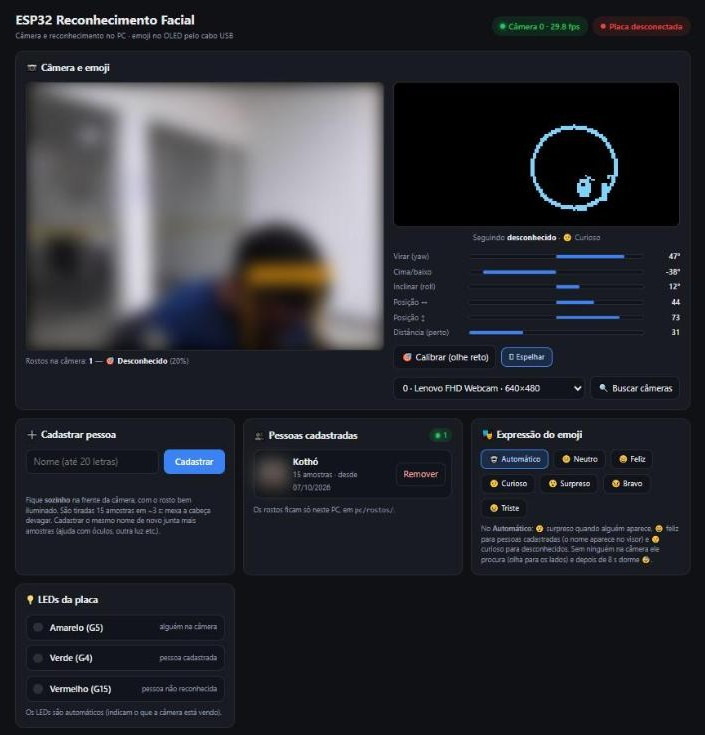
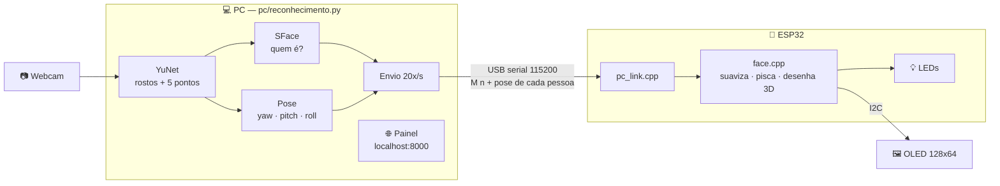
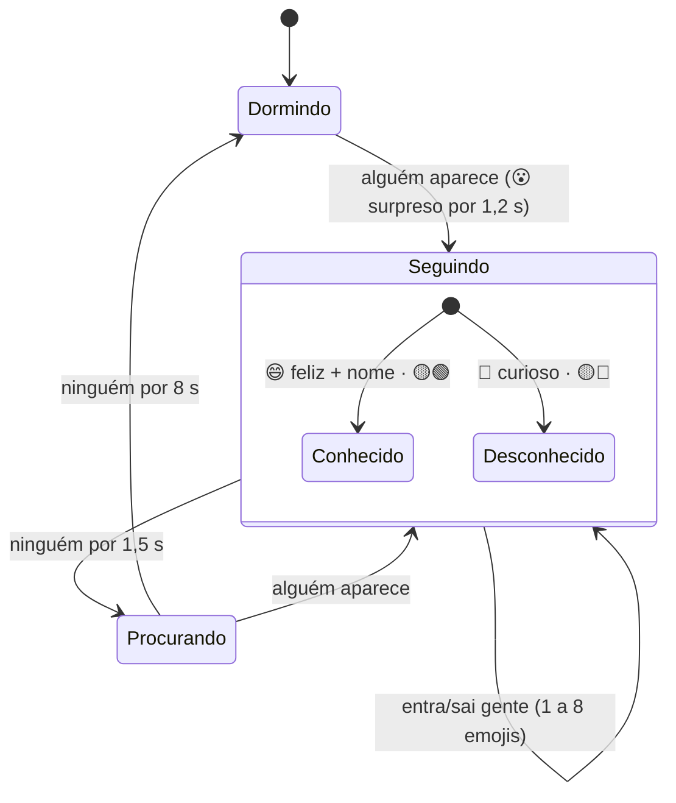

<div align="center">

# 🙂 Programa de Monitoramento Interativo

### Reconhecimento facial com ESP32 + OLED

**A webcam do PC reconhece quem está na frente dela, e um emoji no display OLED do ESP32
imita os movimentos da cabeça da pessoa.**


[Como funciona](#-como-funciona) ·
[Montagem](#-montagem) ·
[Instalação](#-instalação) ·
[Painel](#-o-painel) ·
[Protocolo](#-protocolo-serial) ·
[API](#-api-local) ·
[Problemas](#-problemas-comuns)

<br/><br/>



<sub>O painel em <code>http://localhost:8000</code>: o emoji (à direita) vira a cabeça junto com a
pessoa na câmera. Rosto e foto desfocados no print por privacidade.</sub>

</div>

---

## ✨ O que ele faz

| | |
|---|---|
| 🎥 **Detecta e reconhece rostos** | OpenCV com YuNet (encontra rostos + 5 pontos) e SFace (diz quem é) |
| 🧭 **Calcula a pose da cabeça** | virar (yaw), olhar para cima/baixo (pitch) e inclinar (roll) |
| 🙂 **Um emoji 3D por pessoa** | até 8 no OLED: cada cabeça gira junto com a sua pessoa, cresce quando ela chega perto e pisca sozinha (~31 qps) |
| 😄 **Expressões automáticas** | surpreso quando alguém aparece, feliz para conhecidos, curioso para desconhecidos, dorme sozinho |
| 💡 **3 LEDs indicadores** | 🟡 alguém na câmera · 🟢 alguém cadastrado · 🔴 alguém não reconhecido (podem acender juntos) |
| 🖥️ **Painel web** | câmera ao vivo, prévia do emoji, cadastro de pessoas, busca de câmeras, estado da placa |
| 🕒 **Registro de aparições** | banco SQLite com toda pessoa que passou pela câmera, quando entrou, quando saiu e por quanto tempo; as 5 últimas aparecem no painel |
| 📊 **Relatórios** | por período e por pessoa: totais, tempo por pessoa, por dia e por hora, lista completa, exportação para Excel (CSV) e impressão/PDF |
| 🔒 **Privado** | sem Wi-Fi e sem nuvem: rostos e aparições ficam só no PC (`pc/rostos/` e `pc/dados/`, fora do git) |

## 🧠 Como funciona



### Os estados do emoji



<details>
<summary><b>📐 Como a pose da cabeça é calculada</b></summary>

Com os 5 pontos do YuNet (olhos, nariz e cantos da boca), em `head_pose()`:

- **roll** = ângulo da linha entre os olhos;
- **yaw** = quanto o nariz está deslocado do meio dos olhos:
  `atan(deslocamento / (0,45 × distância entre os olhos))`;
- **pitch** = altura do nariz entre a linha dos olhos e a da boca, comparada com a **calibração**.

No ESP32 (`src/face.cpp`), olhos, sobrancelhas e boca são pontos numa esfera. A esfera é girada
pelos três ângulos e projetada na tela: o que fica "atrás" da cabeça some e o olho de lado fica
mais fino. A placa suaviza o movimento sozinha, então ele fica fluido mesmo que o PC mande
poucas poses.

</details>

<details>
<summary><b>🔍 Como o reconhecimento decide quem é</b></summary>

Cada rosto vira um vetor de 128 números (SFace). A pessoa é reconhecida se a semelhança
(cosseno) com alguma amostra cadastrada passar de **40%** (`MATCH_THRESHOLD` em
`pc/reconhecimento.py`). O nome mostrado é o que mais apareceu nos últimos 5 reconhecimentos
daquele rosto, para não ficar piscando. Com mais pessoas do que o limite escolhido no painel,
viram emoji **as mais perto da câmera**, mostradas da esquerda para a direita.

</details>

## 🔧 Montagem

| Material | Qtd |
|---|---|
| ESP32 DevKit (ESP32-WROOM-32) | 1 |
| Display OLED SSD1306 128x64 I2C (endereço 0x3C) | 1 |
| LEDs 5 mm (amarelo, verde, vermelho) + resistores 220 Ω | 3 |
| Webcam (a do notebook serve; aceita várias) | 1+ |

| OLED | ESP32 | | LED | GPIO | Acende quando |
|---|---|---|---|---|---|
| VCC | 3V3 | | 🟡 Amarelo | GPIO 5 | encontrou alguém na câmera |
| GND | GND | | 🟢 Verde | GPIO 4 | a pessoa está **cadastrada** |
| SDA | GPIO 21 | | 🔴 Vermelho | GPIO 15 | a pessoa **não foi reconhecida** |
| SCL | GPIO 22 | | | | |

Cada LED: `GPIO ──[220 Ω]──►|── GND`. GPIO 5 e 15 são *strapping pins*, mas com o LED ligado
para o GND o boot não é afetado.

## 🚀 Instalação

### 1. Firmware do ESP32

Pelo VS Code com a extensão **PlatformIO IDE**: abra esta pasta e clique em **→ Upload**.
Ou pela linha de comando:

```bash
pio run -t upload        # compila e grava
pio device monitor       # Monitor Serial (feche o programa do PC antes)
```

Ao ligar, o emoji aparece **dormindo** 😴 até o PC mandar alguém.

### 2. Programa do PC

```bash
git clone https://github.com/fernandomoreira/sistema_reconhecimento_facial.git
cd sistema_reconhecimento_facial
pip install -r requirements.txt
python pc/reconhecimento.py
```

No Windows basta dar dois cliques em **`abrir_painel.bat`**: ele instala o que faltar e abre o
painel em **http://localhost:8000**.

| Opção | O que faz |
|---|---|
| `--camera 1` | usa sempre a câmera 1 (sem isso, ele escolhe sozinho a primeira com imagem) |
| `--port COM12` | fixa a porta serial (padrão: detecta o ESP32 sozinho) |
| `--http 8080` | muda a porta do painel |
| `--no-browser` | não abre o navegador |

> [!TIP]
> No primeiro uso, olhe reto para a câmera e clique em **🎯 Calibrar**. Depois cadastre seu
> rosto em **Cadastrar pessoa**.

> [!IMPORTANT]
> Só um programa por vez usa a porta COM. Antes de gravar o firmware ou abrir o Monitor Serial,
> clique em **Liberar porta** no painel (ou feche o programa).

## 🖥️ O painel

| Seção | O que tem |
|---|---|
| **📷 Câmera e emoji** | vídeo ao vivo com os rostos marcados (verde = conhecido, laranja = desconhecido; borda grossa = virou emoji), **prévia do OLED** e barras com a pose da pessoa mais perto |
| **🙂 Emojis no visor** | de **1** (só a pessoa mais perto) até **8** (todos que cabem): um emoji para cada pessoa na câmera |
| **🎯 Calibrar / 🪞 Espelhar** | define a "cabeça reta" / imagem espelhada (o emoji imita como espelho) |
| **🔍 Buscar câmeras** | procura as câmeras ligadas ao PC, com o nome do Windows; avisa se uma está **ocupada** ou com **imagem preta** |
| **➕ Cadastrar pessoa** | 15 fotos em ~3 s; cadastrar o mesmo nome de novo **junta** amostras (óculos, outra luz...) |
| **🤖 Captura automática** | botão deslizante **Sim/Não**. Com Sim, escolha: **Capturar qualquer pessoa** (quem passar na frente da câmera) ou **Captura específica** (só quem olhar fixamente para a câmera por 2 s; a câmera e o visor mostram “Permaneça olhando para finalizar a captura”). Só rostos não reconhecidos são capturados (15 fotos) e salvos como **Desconhecido 1, 2, 3…** |
| **👥 Pessoas cadastradas** | foto, nº de amostras, **✏️ editar o nome** (as aparições antigas acompanham; nome que já existe pode ser **juntado**) e **Remover** (pede confirmação) |
| **🎭 Expressão** | **Automático** ou uma expressão fixa (Neutro, Feliz, Curioso, Surpreso, Bravo, Triste) |
| **💡 LEDs** | embaixo da câmera: os 3 LEDs da placa, acesos em tempo real |
| **🕒 Últimas aparições** | as 5 aparições mais recentes: foto, pessoa, entrada, saída e tempo na câmera (conta ao vivo para quem ainda está lá) |
| **📊 Relatórios** (`/relatorios`) | filtros por período (hoje, ontem, 7/30 dias, mês, tudo ou datas) e pessoa; resumo, tabelas por pessoa e por dia, gráfico por hora, lista completa paginada, **Exportar para Excel (CSV)** e **Imprimir / PDF** |
| **Placa · Câmera · Portas · Log** | estado da conexão, quadros por segundo, portas seriais e mensagens da placa |

### O que o emoji faz sozinho

| Situação | Emoji | LEDs |
|---|---|---|
| Alguém aparece (depois de 3 s sem ninguém, ou chega gente nova) | 😮 Surpreso por 1,2 s | 🟡 |
| Pessoa cadastrada | 😄 Feliz + **nome** (no canto, ou embaixo de cada emoji) | 🟡 🟢 |
| Pessoa desconhecida | 🤨 Curioso | 🟡 🔴 |
| Ninguém na câmera | 🔎 procura (olha para os lados, com "?") | — |
| Ninguém por 8 s | 😴 dorme (cabeça baixa, "z Z") | — |

> [!NOTE]
> A fonte do OLED (CP437) tem á é í ó ú â ê ô à ç ü ñ, mas não tem ã, õ e a maioria das
> maiúsculas acentuadas: essas aparecem sem acento (João → Joao).

## 📡 Protocolo serial

O PC manda uma linha por comando a **115200 baud**; respostas começam com `@` + JSON. Linhas
sem `@` são log.

| Comando | Efeito |
|---|---|
| `STATUS` | devolve o estado |
| `M n` + n × `x y yaw pitch roll size mood known` | n pessoas na câmera (1..8, da esquerda para a direita; até ~20x/s, **sem resposta**). x, y: −100..100 · yaw: −60..60° · pitch, roll: −45..45° · size: 0..100 · mood: 0..5 · known: 1 = cadastrada |
| `L x y yaw pitch roll size mood` | atalho para uma pessoa só (sem resposta) |
| `IDLE` | ninguém na câmera (sem resposta) |
| `NAMES <nome1>\|<nome2>\|...` | nomes na ordem do `M` (CP437, até 20 cada; vazio = desconhecida) |
| `NAME <texto>` | nome só da 1ª pessoa (`NAME` sozinho apaga) |

<details>
<summary><b>Exemplo de respostas e teste pelo Monitor Serial</b></summary>

```
@{"fw":"rosto-esp32","ver":2,"uptime":97,"oled":true,"state":"seguindo","count":2,"max":8,"mood":1,"name":"Ana","names":["Ana","","","","","","",""],"fps":30,"looks":590,"leds":[1,1,1]}
@{"error":"comando desconhecido"}
```

Digite `L -50 0 30 10 15 60 1` no Monitor Serial: o emoji vira a cabeça e sorri. Para três
emojis: `M 3 0 0 30 0 0 50 1 1 0 0 0 0 0 50 2 0 0 0 -30 0 0 50 3 0`. Sem `L`/`M` por
1,5 s ele começa a procurar.

Expressões (`mood`): 0 Neutro, 1 Feliz, 2 Curioso, 3 Surpreso, 4 Bravo, 5 Triste.

</details>

## 🔌 API local

<details>
<summary><b>Rotas HTTP do programa (localhost)</b></summary>

| Método | Rota | Descrição |
|---|---|---|
| GET | `/video` | câmera ao vivo (MJPEG) |
| GET | `/api/status` | placa + câmera + pessoas + log |
| GET | `/api/alvo` | só o rosto seguido e o cadastro em andamento |
| GET | `/foto/<arquivo>.jpg` | foto de uma pessoa cadastrada |
| POST | `/api/cadastrar` (corpo `{"nome": "..."}`) · `/api/cancelar` | cadastro |
| POST | `/api/remover?nome=...` | apaga uma pessoa |
| POST | `/api/renomear` (corpo `{"nome": "...", "novo": "...", "juntar": false}`) | troca o nome (409 se já existe e `juntar` é falso) |
| POST | `/api/auto?on=0\|1&modo=qualquer\|especifico` | captura automática de desconhecidos |
| POST | `/api/humor?id=-1..5` | −1 = automático |
| POST | `/api/calibrar` | posição atual = cabeça reta |
| POST | `/api/espelhar?on=0\|1` · `/api/camera?index=0..9` | câmera |
| POST | `/api/cameras/buscar` | procura de novo as câmeras (resultado em `vision.cams` do status) |
| POST | `/api/emojis?n=1..8` | quantos emojis no visor (um por pessoa, até n) |
| GET | `/relatorios` | página de relatórios |
| GET | `/api/aparicoes?n=5` | últimas aparições |
| GET | `/api/aparicoes/foto/<id>` | foto pequena do rosto daquela aparição |
| GET | `/api/relatorio?de=AAAA-MM-DD&ate=AAAA-MM-DD&pessoa=&pagina=` | totais por pessoa/dia/hora + lista (pessoa: nome, `__conhecidos` ou `__desconhecidos`) |
| GET | `/api/relatorio.csv?...` | todas as aparições do filtro em CSV (`;`, abre direto no Excel) |
| POST | `/api/port?name=COM12\|auto` · `/api/release` · `/api/resume` | porta serial |

</details>

## 🩺 Problemas comuns

| Sintoma | O que verificar |
|---|---|
| Câmera "ocupada por outro programa" | Feche Teams, Zoom ou o app Câmera do Windows e clique em **🔍 Buscar câmeras**. |
| Câmera com "imagem preta" | Obturador ou tampa do notebook fechados? Escolha outra câmera na lista. |
| Poucos quadros por segundo | Mais luz: no escuro a webcam baixa sozinha os quadros por segundo. |
| Não reconhece a pessoa | Cadastre de novo com o mesmo nome em outra luz, ou baixe `MATCH_THRESHOLD`. |
| Confunde duas pessoas | Aumente `MATCH_THRESHOLD` (ex.: 0,45). |
| Emoji "olha para cima" com a cabeça reta | Olhe reto para a câmera e clique em **Calibrar**. |
| Emoji vira para o lado errado | Ligue/desligue **Espelhar**. |
| "Sem resposta" (amarelo) | A placa está com outro firmware: grave este projeto. |
| "Placa desconectada" | Cabo USB só de energia? Driver do CP210x/CH340 instalado? |
| "Display OLED: não encontrado" | SDA/SCL invertidos? VCC no 3V3? Endereço 0x3D? (`OLED_ADDR` em `src/display.cpp`). |

## 📁 Estrutura

```
sistema_reconhecimento_facial/
├── platformio.ini          # placa e bibliotecas (Adafruit SSD1306 + GFX)
├── requirements.txt        # bibliotecas Python do PC
├── abrir_painel.bat        # atalho do Windows: instala o que faltar e abre o painel
├── CLAUDE.md               # memória do projeto para o Claude Code
├── docs/painel.jpg         # print do painel usado neste README
├── src/                    # firmware do ESP32
│   ├── main.cpp            # setup() e loop(): junta os módulos
│   ├── display.h/.cpp      # liga o OLED
│   ├── face.h/.cpp         # animação e desenho do emoji 3D + lógica dos LEDs
│   ├── leds.h/.cpp         # LEDs indicadores
│   └── pc_link.h/.cpp      # comandos recebidos do PC pela serial
└── pc/                     # programa do PC
    ├── reconhecimento.py   # câmera, reconhecimento, serial e servidor do painel
    ├── registro.py         # banco das aparições (SQLite) e relatórios
    ├── painel.html         # painel (a prévia do emoji é uma cópia em JS de face.cpp)
    ├── relatorios.html     # página de relatórios
    ├── modelos/            # YuNet e SFace (.onnx; baixados sozinhos se faltarem)
    ├── rostos/             # pessoas cadastradas — fica só no PC (no .gitignore)
    └── dados/              # monitoramento.db: todas as aparições — fica só no PC (no .gitignore)
```

## 🙏 Créditos

- Modelos [YuNet](https://github.com/opencv/opencv_zoo/tree/main/models/face_detection_yunet)
  e [SFace](https://github.com/opencv/opencv_zoo/tree/main/models/face_recognition_sface) do
  OpenCV Zoo.
- [Adafruit SSD1306](https://github.com/adafruit/Adafruit_SSD1306) e
  [Adafruit GFX](https://github.com/adafruit/Adafruit-GFX-Library).
- Projeto irmão: `Display_OLED_Faces` (mesma placa e mesmo painel).

## 🕒 Registro de aparições

Cada vez que um rosto fica na câmera, o programa grava uma **aparição** em
`pc/dados/monitoramento.db` (SQLite): pessoa (ou "Desconhecido"), entrada, saída, duração,
câmera, semelhança com o cadastro e uma foto pequena do rosto.

- Aparições com menos de **1 s** não são gravadas (são piscadas do detector) — `MIN_S` em `pc/registro.py`.
- Se uma pessoa **cadastrada** some e volta em até **5 s**, continua sendo a mesma aparição (`JUNTAR_S`).
- Enquanto a pessoa está na câmera, a aparição é atualizada a cada 2 s; se o programa for
  fechado de repente, ela é fechada no último horário salvo.
- Para abrir o banco em outro programa (ex.: DB Browser for SQLite), a tabela é `aparicoes`.
